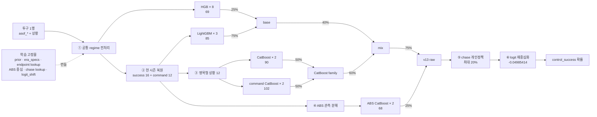

# 방법론 — v13 (실전 최고, 리더보드 1038)

이 문서는 현행 모델의 단일 계약이다. 한 행(투구 하나)의 `control_success=1`
확률을 어떻게 만드는지, 입력 → 피처 → 모델 → 출력 순으로 적는다.
번들 버전 이름은 `v13_shared_regime_chase`다.

## 0. 용어

| 용어 | 뜻 |
|---|---|
| `asof_*` | 그 투구 **직전까지** 집계된 공식 사전 정보 컬럼 (누적 투구수 `n`, 누적 비율 `rate`) |
| EB 축소 | Empirical Bayes shrinkage. 표본 `n`이 작은 비율을 기준값 쪽으로 당기는 것: `(n·rate + k·기준)/(n+k)`, `k=50` |
| 신뢰도 | `n/(n+k)`. 0~1, 표본이 많을수록 1 |
| season center | 학습 데이터에서 구한 **그 시즌 리그 평균 rate**. `era_specs`에 시즌별 관측값 + 최근 3시즌 직선 외삽식으로 저장 |
| regime skill | `신뢰도 × (선수 rate − season center)`. "그 시즌 리그 대비 상대 능력" |
| 현 시즌 (`std_*`) | 평가 시즌(2025) 안에서만 누적된 값. 누적 `asof`에서 학습 마지막 시즌 종료 endpoint를 뺀 복원값 |
| ABS | 자동 볼·스트라이크 판정. 2024부터 관측체계가 달라진 구간을 뜻한다 |
| chase | 2스트라이크 · 논풀카운트 상황 (`strikes_before==2` & `balls_before<3`) |
| lookup | 학습 시점에 만들어 번들에 고정한 표. 추론 때는 읽기만 한다 |

## 1. 예측 계약

- 입력은 **평가 행 하나 + 번들에 고정된 학습 상수/lookup**뿐이다.
- 사용 정보는 투구 직전까지 확정된 것만이다.
- 평가지표가 확률을 직접 보는 Brier Skill Score이므로, 최종 재중심화까지 모델의 일부다.

## 2. 전체 흐름



모델 5계열은 **병렬**이다. 서로의 예측을 입력으로 받지 않고 각자 정답을 직접 학습한 뒤,
확률 수준에서 고정 가중 평균으로 합친다.

## 3. 입력 가공

### ① 공통 regime 전처리 — v13의 핵심 변경

v13은 **모든 모델 앞에서** 장기 rate를 상대 축으로 바꾼다. 스트라이크 존과 판정
체계가 시즌마다 달라지므로, 절대 비율 0.52는 시즌에 따라 다른 뜻을 갖는다.

```text
era_specs[rate]      = 시즌별 관측 평균 + 최근 3시즌 직선 외삽식   (학습 시점 고정)
season_center        = era_specs로 그 행의 season 하나만 계산
regime_skill         = n/(n+50) × (rate − season_center)
```

- 대상: 누적 rate 10개(투수 success/strike/ball/middle/reverse, 타자 success/middle,
  구종 fastball/breaking/offspeed) + 최근 1·3·5경기 rate 6개.
- 파생 3개(`command_gap`, `recent_trend`, `batter_pitcher_gap`)도 변환된 값으로 다시 만든다.
- 공통 입력에서는 대응하는 **절대 rate와 절대 EB rate 자리를 이 상대값이 대신한다.**
- 표본 크기 자체(`log1p(n)`, `n/(n+50)`)와 상황 컬럼(이닝·카운트·주자·점수차·LI·손·팀)은
  절대값 그대로 남는다.
- 정답 라벨 `control_success`는 그대로 둔다.

### ② 현 시즌(2025) 복원 — success 16 + command 12

평가 시즌 정보는 누적값 안에 섞여 들어온다. 학습 데이터에서 **투수·타자별 마지막
시즌 종료 endpoint**(`end_n`, `end_count`)를 lookup으로 고정하고, 행의 누적에서 뺀다.

```text
current_n    = asof_n − end_n
current_cnt  = round(asof_n × asof_rate) − end_count
current_rate = current_cnt / current_n
```

여기에도 같은 regime 변환을 적용한다.

```text
current_skill        = current_rate − season_center
current_shrunk_skill = current_n/(current_n+50) × current_skill
current_deviation    = current_shrunk_skill − career_regime_skill
```

- **success 블록(투수·타자 8개씩 = 16)**: lookup 존재 여부, 누적 감소 이상치 플래그,
  현 시즌 `n`·`log1p(n)`·신뢰도, 그리고 위 skill 3개.
- **command 블록(strike/ball/middle/reverse × 3 = 12)**: 같은 방식. 현재 투구의 세부
  판정은 미확정이므로 success와 달리 마지막 투구를 +1로 복원하지 않는다.
- 신규 선수는 누적 0에서 시작하고, 이상치는 플래그로 표시해 모델이 판단한다.

### ③ CatBoost 명목형 상황 12개

ID를 숫자 크기로 읽지 않도록 문자열 category key로만 쓴다: 투수·타자·양 팀 ID,
투수·타자 손, 초/말, 경기 유형, 주자 상태, 카운트 상태(`3_2` 식),
pressure 상태(full count·RISP·high LI·접전 조합), 이닝 구간(early/middle/late/extra).
CatBoost가 최대 2차 조합(`max_ctr_complexity=2`)과 ordered target statistics를 학습해
모델 안에 굳힌다.

### ④ ABS 관측 분해 — ABS expert 전용 입력

ABS expert는 시즌이 섞인 통산 rate 대신 **현 시즌 + 최근 경기 정보**만 본다.
투수 success/strike/ball/middle/reverse와 타자 success를, **2024년 5~9월(성숙 구간)
학습 데이터의 중앙값·IQR**을 기준으로 셋으로 쪼갠다.

```text
abs_centered = (현시즌 EB rate − center) / IQR        측정 축 위의 위치
abs_signal   = 신뢰도 × abs_centered                  표본으로 뒷받침된 신호
abs_noise    = sqrt(rate(1−rate)/n)                   그 값의 표본오차
```

여기에 command 종합 2개(`middle+reverse+ball−strike`의 centered·signal 버전)를 더한다.
학습은 2024년만 쓰고, 적응 구간에 낮은 학습 가중치를 준다: 3월 0.20, 4월 0.45, 5월 이후 1.0.

## 4. 모델 구성

| 계열 | 개수 | 입력 | 하이퍼 |
|---|---:|---|---|
| HistGradientBoosting | 8 | 공통 regime 69 | 이질 조합 (lr 0.02~0.06, leaves 31~127, seed 8종) |
| LightGBM | 3 | 69 + 현시즌 success 16 = 85 | lr 0.02/0.03/0.05, leaves 127/63/31 |
| CatBoost | 2 | 명목형 12 + 수치 + 현시즌 = 90 | 350 trees, depth 7, lr 0.05, l2 10, seed 2026/2718 |
| command CatBoost | 2 | 위 90 + command 12 = 102 | 동일, seed 2026/2718 |
| ABS CatBoost | 2 | ABS 분해 68 (2024만 학습) | 350 trees, depth 7, lr 0.05, l2 15, seed 4242/5151 |

**HGB vs LightGBM**: HGB는 안정된 공통 입력만, LightGBM은 현 시즌 신호까지 본다.
**CatBoost 2쌍**: 선수·상황 ID 조합을 잡는 것이 역할이고, command 버전은 거기에
"이 투수가 올해 어디로 던지고 있는지"를 더한 것이다.
**ABS expert**: 관측체계가 바뀐 최신 구간만 학습한 소수 의견이다.

## 5. 혼합과 출력

순서대로 확률을 섞는다. 모든 가중치는 학습 시점에 고정된 상수다.

```text
base    = 0.25 × mean(HGB8)      + 0.75 × mean(LGBM3)
catfam  = 0.50 × mean(CatBoost2) + 0.50 × mean(CommandCatBoost2)
mix     = 0.40 × base            + 0.60 × catfam
raw     = 0.75 × mix             + 0.25 × mean(ABSExpert2)
```

### ⑤ chase 개인 정책 (해당 행에만, 최대 20%)

2스트라이크·논풀카운트 행에서만 **그 투수 자신의** 최신 학습 시즌 chase 성향을 쓴다.
다른 투수의 평균·유사도·embedding은 개입하지 않는다.

```text
chase_rate  = (chase 성공 + 100 × 그 투수 시즌 전체 성공률) / (chase 투구수 + 100)
personal    = sigmoid( logit(chase_rate) + logit(현시즌 성공률) − logit(과거 전체 성공률) )
reliability = sqrt[ n_hist/(n_hist+200) × n_chase/(n_chase+100) × n_cur/(n_cur+50) ]
p           = (1 − 0.20×reliability) × raw + (0.20×reliability) × personal
```

세 표본 중 하나라도 얇으면 `reliability`가 작아져 원래 예측이 거의 그대로 남고,
미관측 투수·이상 누적은 가중치 0으로 원래 예측을 쓴다.

### ⑥ 재중심화 → 최종 출력

리그 성공률이 해마다 움직이므로, 최근 3시즌 추세로 평가 시즌 평균을 외삽하고
모델의 2024 자연 평균과 그 값의 **중간 지점**(`recenter_f=0.5`)을 목표로 로짓을 평행이동한다.
상수는 학습 시점에 이분탐색으로 한 번 구해 번들에 넣는다.

```text
logit_shift      = -0.04985414
final_prob = sigmoid( logit(p) − 0.04985414 )
```

출력은 행별 확률 하나이며, `output/submission.csv`의 `row_id, control_success`로 나간다.
각 행은 독립 계산이라 평가 데이터의 다른 행이나 전체 분포가 개입할 여지가 없다.

## 6. 재현 순서

```bash
python3 scripts/build_final.py 50 te0 8 0.5 3 era1 context0 season1 0.75
python3 scripts/build_catboost_final.py
python3 scripts/build_catboost_command_final.py
cp open/baseline_submit/model/bundle_v13_command_candidate.pkl open/baseline_submit/model/bundle.pkl
python3 scripts/build_abs_regime_final.py
cp open/baseline_submit/model/bundle_v13_abs_candidate.pkl open/baseline_submit/model/bundle.pkl
python3 scripts/build_pitcher_policy_final.py   # -> bundle_v13_shared_regime_candidate.pkl
```

학습·재학습은 Colab에서 돌린다(`CLAUDE.md` §6). 번들에는 모델과 함께 prior, `era_specs`,
endpoint lookup, ABS 중심, chase lookup, 피처 순서, 혼합 가중치, `logit_shift`가 함께 들어간다.

## 7. 검증과 성과

- 학습 피처 기준은 `scripts/pipeline.py`, 제출 추론은 `open/baseline_submit/script.py`이며
  두 경로의 값·컬럼 순서 동등성을 `test_submission_path.py`, `test_shared_regime_path.py`,
  `test_catboost_submission_path.py`, `test_pitcher_policy_submission_path.py`로 확인한다.
- 모델 비교는 과거 시즌 학습 → 2022/2023/2024 검증의 forward chaining, 다중 시드 평균,
  paired BSS와 표준오차, 세 시즌 방향 일관성으로 판단한다.
- 의존성: scikit-learn 1.8.0, LightGBM 4.7.0, CatBoost 1.2.8.
- 실전 리더보드: **v13 = 1038** (이전 확인 최고 v11 = 1018, v10 = 1010).
- 이식용 작업본은 코드·기록만 담고, 번들과 `submit.zip`은 새 서버에서 재생성한다.
