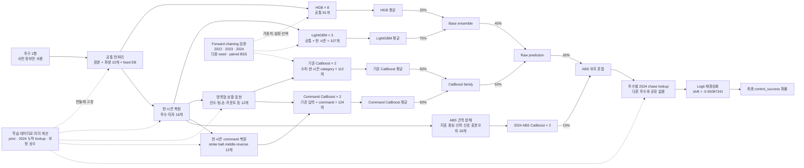

# 현재 방법론 — v12 투수별 chase policy

이 문서는 과거 실험사를 담지 않는다. 현재 루트 `submit.zip`이 사용하는 입력,
가공, 모델, 혼합 및 보정 계약만 설명한다. 과거 실험과 기각 근거는
[`docs/EXPERIMENTS.md`](docs/EXPERIMENTS.md)에서 날짜별 기록을 찾는다.

## 0. 전체 구조도



실선은 한 평가 행의 추론 흐름, 점선은 학습 시점에 결정되어 번들에 고정되는 정보와
검증 절차를 뜻한다. 평가 시점에는 다른 test 행을 참조하지 않는다.

## 1. 예측 계약

- 한 행은 투구 하나이며 `control_success=1` 확률을 예측한다.
- 투구 직전 정보만 사용한다. 현재 투구의 구종·코스·결과·Trackman 값은 사용하지 않는다.
- test의 다른 행, 전체 분포, 행 순서로 만든 통계는 사용하지 않는다.
- 추론 피처는 현재 행과 학습 데이터에서 미리 계산해 번들에 고정한 상수·lookup만으로
  계산한다.
- 평가는 확률 자체를 비교하는 Brier Skill Score이므로 최종 calibration까지 모델의
  일부로 취급한다.

## 2. 현재 입력 표현

### 공통 입력과 EB 축소

원본 경기·카운트·점수·주자·중요도·선수·팀·`asof_*` 컬럼에 행 단위 파생 피처
10개를 추가한다. 주요 파생값은 full count, RISP, 좌우 매치업, 통산 command gap,
최근 1경기와 5경기 차이, 접전 여부다.

누적 비율은 표본 수에 따라 다음과 같이 경험적 베이즈 축소한다.

```text
shrunk_rate = (n × rate + 50 × train_prior) / (n + 50)
```

최근 1·3·5경기 비율은 리그 평균이 아니라 해당 투수의 축소된 통산 비율 쪽으로
당긴다. 표본 수의 `log1p(n)`과 `n/(n+50)`도 신뢰도 피처로 사용한다.

### 현 시즌 success/workload

투수와 타자별 2024 시즌 종료 누적 `n`과 성공 횟수를 학습 데이터에서 lookup으로
고정한다. 평가 행의 누적 `asof_n`, `round(n×success_rate)`에서 이를 빼 2025 현
시즌 투구 수와 성공률을 복원한다. 신규 선수는 누적 0에서 시작한다.

투수·타자 각각 다음 8개, 총 16개다.

- 과거 lookup 존재 여부와 잘못된 누적 감소 여부
- 현 시즌 `n`, `log1p(n)`, 신뢰도
- 현 시즌 raw 성공률과 EB 성공률
- 현 시즌 EB 성공률과 통산 EB 성공률의 차이

### 현 시즌 command profile

투수별 이전 시즌 종료 누적값을 학습 데이터 lookup으로 고정한 뒤, 현재 행의
`asof_pitcher_n × rate`에서 빼 현 시즌 strike·ball·middle·reverse 비율을 복원한다.
각 outcome마다 raw 비율, EB 비율, 통산 EB 대비 편차 3개씩 총 12개다. 현재 투구의
세부 outcome은 알 수 없으므로 이전 endpoint의 마지막 투구는 success와 달리 +1로
복원하지 않는다. 계산은 현재 평가 행 하나와 고정 lookup만 사용한다.

### CatBoost 명목형 선수·상황

`pitcher_id`, `batter_id`, 팀 ID는 숫자 크기에 의미를 두지 않고 문자열 category
lookup key로만 사용한다. 다음 12개 범주를 사용한다.

- 투수·타자·양 팀 ID
- 투수·타자 손
- 초/말, 경기 유형, 주자 상태
- 볼-스트라이크 count state
- full count·RISP·high LI·접전을 묶은 pressure state
- 이닝 구간

CatBoost는 최대 2차 category 조합과 ordered target statistics를 학습한다. 학습된
통계는 모델 안에 고정되며 추론 중 test 행끼리 통계를 계산하지 않는다.

### ABS 관측체계 분해

ABS 전용 expert는 오염된 통산 rate를 버리고 현재시즌 누적과 최근경기 정보만 쓴다.
success/strike/ball/middle/reverse 및 타자 success를 2024년 5~9월 학습 데이터의
중앙값·IQR에 대한 상대 위치, `n/(n+50)`을 곱한 신뢰 신호, Bernoulli 표준오차로
나눠 입력한다. 초기 적응 구간은 삭제하지 않고 3월 0.20, 4월 0.45, 이후 1.0의
학습 가중치를 사용한다. 외부 ABS 수치나 평가 데이터 분포는 입력하지 않는다.

### 투수별 chase 개인 정책

2스트라이크·비풀카운트에서만 2024의 같은 투수 성공률을 사용한다. 투수별 chase
성공률은 그 투수 자신의 2024 전체 성공률로 `k=100` 축소하며, 다른 투수 평균·유사도·
embedding은 쓰지 않는다. 현재 행의 누적값에서 2024 종료 endpoint를 빼 2025 같은
투수의 전체 성공률 변화를 복원하고 `k=50`으로 축소한다. 과거 전체 표본, chase 표본,
현재시즌 표본의 신뢰도를 기하평균해 최대 20%만 혼합한다. 신규·미관측 투수와 잘못된
누적은 가중치 0으로 v11 예측에 그대로 복귀한다.

## 3. 현재 모델과 혼합

| 계열 | 멤버 | 입력 | 계열 내부 평균 |
|---|---:|---|---:|
| HistGradientBoosting | 8 | 공통 fixed-EB 91개 | HGB 평균 |
| LightGBM | 3 | 공통 91개 + 현 시즌 16개 = 107개 | LGBM 평균 |
| CatBoost | 2 | 수치·현 시즌 + 명목형 category, 총 112개 | 기존 평균 |
| Command CatBoost | 2 | 기존 CatBoost 입력 + command 12개, 총 124개 | command 평균 |
| ABS Regime CatBoost | 2 | 현재시즌·최근경기·관측분해, 총 68개 | ABS 평균 |

먼저 HGB와 LightGBM을 다음처럼 합친다.

```text
base = 0.25 × mean(HGB8) + 0.75 × mean(LGBM3)
```

그다음 CatBoost expert와 혼합한다.

```text
catboost_family = 0.50 × mean(CatBoost2) + 0.50 × mean(CommandCatBoost2)
raw_prediction = 0.40 × base + 0.60 × catboost_family
```

마지막으로 ABS 전용 expert를 보수적으로 섞는다.

```text
raw_prediction_v11 = 0.90 × raw_prediction + 0.10 × mean(ABSExpert2)
```

마지막으로 해당 행이 chase 상황일 때만 개인 정책을 적용한다.

```text
personal = logit⁻¹(logit(chase_2024) + logit(success_2025) - logit(success_2024))
reliability = √[n2024/(n2024+200) × nchase/(nchase+100) × n2025/(n2025+50)]
raw_prediction_v12 = (1 - 0.20×reliability) × raw_prediction_v11
                     + (0.20×reliability) × personal
```

CatBoost는 seed 2026/2718, 350 trees, depth 7, learning rate 0.05,
`max_ctr_complexity=2`를 사용한다.

## 4. 재중심화

최근 3개 학습 시즌의 성공률 추세로 다음 시즌 리그 평균을 학습 시점에 외삽한다.
최종 혼합 모델의 2024 자연평균과 외삽값 사이 절반 지점을 목표로 한다.

```text
recenter_f = 0.5
2024 mixed natural mean = 0.48732353
target mean = 0.47475110
logit_shift = -0.05087341
```

추론에서는 각 행에 독립적으로 다음 변환만 적용한다.

```text
final_probability = sigmoid(logit(raw_prediction_v12) - 0.05087341)
```

## 5. 학습·검증·제출 계약

- 모델 비교: 과거 시즌 학습 → 2022/2023/2024 검증의 forward chaining
- 판단: 다중 시드 평균, paired BSS gain과 표준오차, 세 시즌 방향 일관성
- 학습 피처 기준: `scripts/pipeline.py`
- 제출 피처 복제: `open/baseline_submit/script.py`
- 최종 번들: HGB8 + LightGBM3 + CatBoost2 + Command CatBoost2 + ABS CatBoost2, 52.5MB
- 의존성: scikit-learn 1.8.0, LightGBM 4.7.0, CatBoost 1.2.8
- 245,789행 모사 피처 생성+추론: 107.66초
- 최종 ZIP SHA-256:
  `d455adc05108e56eef1d128904270cecdb60ff933124b17e87cedefb1807e47d`

현재 루트 ZIP은 미제출 v12 후보다. 확인 최고 v11(1018)은
`backups/submit_v11_1018_backup.zip`, v10(1010)은
`backups/submit_v10_1010_backup.zip`에 보존돼 있다.
